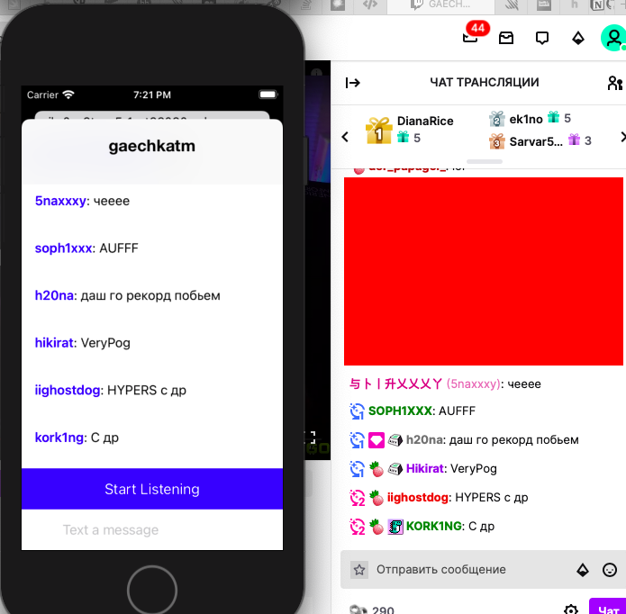

# TwitchChatApplication

This application is aimed primarily at novice streamers who do not have a second monitor to read the chat.
It can also help a popular streamers that make "irl" stream. For example, when several streamers from the one stream travel in a car, they can't easily read the chat from the stream, it requires a lot of battery power and cellular network data because the original twitch application requires downloading the stream.
This app is designed to reduce battery power and cellular data requirements.

----
## Example of working version

Here you can see the twitch user authorization and automatic connection to the chat (the chat channel was hard-coded yet) =)

All layout of UIElements was coded programmatically

---

### Screenshot of chat on browser and application

